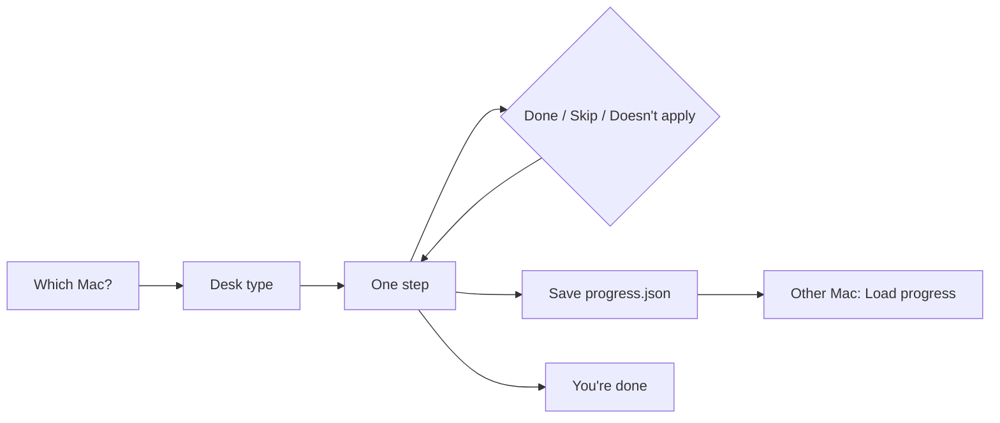

# TwinKit

**Clone your Claude Code (and Codex) desk onto the Mac you leave at home.**

You still sign in yourself. TwinKit keeps the mountain from becoming a fog.

| | |
| --- | --- |
| **Version** | 0.5.1 |
| **What it is** | Four Terminal scripts + a timed checklist in the browser |
| **Who it’s for** | People whose *primary* Claude Code environment is a Mac, cloning it to a Mini / Studio / spare |
| **What it is not** | Auto-login, a native menu bar app, or a cloud sync service |
| **License** | MIT |

---

## Install (10 seconds, no Node)

```bash
curl -fsSL https://raw.githubusercontent.com/a12k-a2b/twinkit/main/install.sh | bash
```

That puts `twin-discover`, `twin-pack`, `twin-unpack`, and `twin-verify` in `~/.twinkit` and (if it can) on your PATH via `~/.local/bin`.

Checklist app (optional):

```bash
git clone https://github.com/a12k-a2b/twinkit.git
cd twinkit
npm install
npm run dev
```

To host it at `https://a12k-a2b.github.io/twinkit/`, turn on **Settings → Pages → GitHub Actions** once. The workflow is already in the repo.

---

## Workflow

```
  OLD MAC (the one that works)          NEW MAC (home Mini / Studio)
  ─────────────────────────────         ─────────────────────────────
  1. twin-discover                      4. twin-unpack --dry-run PACK
  2. twin-pack                          5. twin-unpack PACK
     → ~/Desktop/twinkit-pack-*         6. twin-verify PACK
  3. AirDrop / FileVault SSD  ───────►  7. Re-login + Mac permissions
                                        8. Sprint the checklist until done
```

Human auth, Accessibility, Chrome extensions, and API keys **never** get cloned. That’s a feature.



### 1. Pick a lane (30 seconds)

| You are on… | Mode | Scripts |
| --- | --- | --- |
| The Mac that already works | **Pack** | `twin-discover` → `twin-pack` |
| The new Mini / Studio / spare | **Unpack** | `twin-unpack` → `twin-verify` |

Desk types (don’t overthink it):

| Desk | Includes |
| --- | --- |
| **Agents** | Claude + Codex, Chrome logins, permissions, SSH |
| **Agents + CLIs** | Above + Grok Build + Muse Spark |
| **Full lab** | Above + Android / Gradle + Daylight DC1 |

### 2. Sprint (the whole product)

Pick 15 / 30 / 60 minutes (or a 25-min body double). TwinKit shows **exactly one step**:

- **Done**
- **Skip for now**
- **Doesn’t apply** (hard skip — no second confession)
- On-card **Download script / Copy command / Open System Settings / Open sign-in**

Timer ends → win screen + save `progress.json`. Stopping is the feature.

Lanes stay locked until you unlock them:

| Lane | Meaning |
| --- | --- |
| **Must** | Agents actually work |
| **Later** | Android / Daylight DC1 |
| **Polish** | Grok, Muse, extras |

### 3. Move the pack

`twin-pack` writes `~/Desktop/twinkit-pack-<stamp>/`:

| File | Purpose |
| --- | --- |
| `MANIFEST.md` | Host, arch, tool versions |
| `progress.json` | Checklist state you Load on the other Mac |
| `SECRETS_REPORT.md` | Pattern hits (pack **exits 2** unless you force-allow) |
| `claude/`, `codex/`, `dotfiles/`, `brew/` | Configs (redacted shell rc, **no private keys**) |

Prefer a **FileVault SSD** over iCloud Drive.

### 4. Unpack + prove it

```bash
twin-unpack --dry-run ~/Desktop/twinkit-pack-*
twin-unpack           ~/Desktop/twinkit-pack-*
twin-verify           ~/Desktop/twinkit-pack-*
```

Then the boring human part: Claude login, Codex login, Chrome extensions, **Accessibility / Screen Recording / Files and Folders**.

---

## Scripts

| Command | Does |
| --- | --- |
| `twin-discover` | Inventory tools + Daylight-ish paths → `INVENTORY.json` |
| `twin-pack` | rsync configs, redact rc, secret scan, write `progress.json` |
| `twin-unpack` | Restore with `.twinkit-backup`; supports `--dry-run` |
| `twin-verify` | Compare MANIFEST vs this Mac → `PARITY.md` + `PARITY.json` |

Pack **requires `rsync`**. There is no `cp -R` fallback.

Safety (non-negotiable):

- Shell rc is **redacted** by default (`TWINKIT_PACK_RAW_RC=1` to keep raw)
- Secret patterns (`sk-`, `ghp_`, `AKIA`, private key banners, …) **fail the pack** unless `TWINKIT_ALLOW_SECRETS=1`
- SSH **public** keys only
- Claude / Codex **credentials excluded**

---

## Run the checklist locally

Needs **Node 22**.

```bash
git clone https://github.com/a12k-a2b/twinkit.git
cd twinkit
npm install
npm run dev
```

```bash
npm run typecheck
npm run build
```

Progress in the browser is `localStorage`. Always **Save progress** into the pack folder before switching machines.

### Claude Code skill

Installer copies this if `~/.claude` exists. Otherwise:

```bash
mkdir -p ~/.claude/skills/twinkit-migrate
cp ~/.twinkit/SKILL.md ~/.claude/skills/twinkit-migrate/SKILL.md
```

---

## Honest limits

| Wanted | Reality |
| --- | --- |
| Native Mac menu bar | Browser HUD while the tab is open. Raycast helper in extras. |
| Clone logins | You must re-auth. OAuth cookies are not packed. |
| Cloud progress | Pack folder `progress.json` is the sync. |
| Perfect Android / Gradle twin | Paths + Brewfile + notes; SDK licenses still human. |

---

## Typical times

| Lane | Catalog |
| --- | --- |
| Pack only | ~45–90 min |
| Unpack + re-auth + permissions | a few hours with coffee |
| Full lab (Android + Daylight) | longer; optional lane — skip without shame |

---

## License

MIT. Treat pack folders as **sensitive config**, not Dropbox souvenirs.
